# Kaggle_Titanic

>高级编程技术期末大作业实验报告
>
>姓名：刘泳杅	学号：17341113
>
>姓名：廖浩淳	学号：17341096'
>
>日期：2019年6月28日


## 问题初探 

### 分析问题

        泰坦尼克号的沉没是历史上最臭名昭著的沉船事件之一。1912年4月15日，泰坦尼克号在处女航中与冰山相撞，2224名乘客和船员中有1502人丧生。这场轰动性的悲剧震惊了国际社会，并导致了更好的船舶安全规则。这次海难造成人员伤亡的原因之一是没有足够的救生艇供乘客和船员使用。尽管在沉船中幸存下来有一些运气因素，但有些人比其他人更可能存活下来，如妇女、儿童和上层阶级。
        在这个挑战中，我们要求您分析哪些人可能存活。特别是，我们要求您应用机器学习工具来预测哪些乘客在悲剧中幸存下来。

### 导入数据


```python
%matplotlib inline
import pandas as pd
import numpy as np
import matplotlib.pyplot as plt
import seaborn as sns
import warnings
warnings.filterwarnings('ignore')

train = pd.read_csv(r'.\data\train.csv')
test = pd.read_csv(r'.\data\test.csv')
PassengerId = test['PassengerId']
```

## 数据分析

### 总体预览


```python
# import pandas_profiling
# profile = pandas_profiling.ProfileReport(train)
# profile.to_file(output_file="./output/Titanic data profiling.html")
```


```python
print ('train.shape: ', train.shape)
print ('test.shape: ', test.shape)
```

    train.shape:  (891, 12)
    test.shape:  (418, 11)


```python
train.head()
```


<div>
<style scoped>
    .dataframe tbody tr th:only-of-type {
        vertical-align: middle;
    }

    .dataframe tbody tr th {
        vertical-align: top;
    }
    
    .dataframe thead th {
        text-align: right;
    }
</style>
<table border="1" class="dataframe">
  <thead>
    <tr style="text-align: right;">
      <th></th>
      <th>PassengerId</th>
      <th>Survived</th>
      <th>Pclass</th>
      <th>Name</th>
      <th>Sex</th>
      <th>Age</th>
      <th>SibSp</th>
      <th>Parch</th>
      <th>Ticket</th>
      <th>Fare</th>
      <th>Cabin</th>
      <th>Embarked</th>
    </tr>
  </thead>
  <tbody>
    <tr>
      <th>0</th>
      <td>1</td>
      <td>0</td>
      <td>3</td>
      <td>Braund, Mr. Owen Harris</td>
      <td>male</td>
      <td>22.0</td>
      <td>1</td>
      <td>0</td>
      <td>A/5 21171</td>
      <td>7.2500</td>
      <td>NaN</td>
      <td>S</td>
    </tr>
    <tr>
      <th>1</th>
      <td>2</td>
      <td>1</td>
      <td>1</td>
      <td>Cumings, Mrs. John Bradley (Florence Briggs Th...</td>
      <td>female</td>
      <td>38.0</td>
      <td>1</td>
      <td>0</td>
      <td>PC 17599</td>
      <td>71.2833</td>
      <td>C85</td>
      <td>C</td>
    </tr>
    <tr>
      <th>2</th>
      <td>3</td>
      <td>1</td>
      <td>3</td>
      <td>Heikkinen, Miss. Laina</td>
      <td>female</td>
      <td>26.0</td>
      <td>0</td>
      <td>0</td>
      <td>STON/O2. 3101282</td>
      <td>7.9250</td>
      <td>NaN</td>
      <td>S</td>
    </tr>
    <tr>
      <th>3</th>
      <td>4</td>
      <td>1</td>
      <td>1</td>
      <td>Futrelle, Mrs. Jacques Heath (Lily May Peel)</td>
      <td>female</td>
      <td>35.0</td>
      <td>1</td>
      <td>0</td>
      <td>113803</td>
      <td>53.1000</td>
      <td>C123</td>
      <td>S</td>
    </tr>
    <tr>
      <th>4</th>
      <td>5</td>
      <td>0</td>
      <td>3</td>
      <td>Allen, Mr. William Henry</td>
      <td>male</td>
      <td>35.0</td>
      <td>0</td>
      <td>0</td>
      <td>373450</td>
      <td>8.0500</td>
      <td>NaN</td>
      <td>S</td>
    </tr>
  </tbody>
</table>
</div>


从上可见，数据集包含12个变量，1309条数据，其中891条为训练数据，418条为测试数据

- PassengerId 整型变量，标识乘客的ID，递增变量，对预测无帮助
- Survived 整型变量，标识该乘客是否幸存。0表示遇难，1表示幸存。
- Pclass 整型变量，标识乘客的社会-经济状态，1代表Upper，2代表Middle，3代表Lower
- Name 字符型变量，除包含姓和名以外，还包含Mr. Mrs. Dr.这样的具有西方文化特点的信息
- Sex 字符型变量，标识乘客性别
- Age 整型变量，标识乘客年龄，有缺失值
- SibSp 整型变量，代表兄弟姐妹及配偶的个数。其中Sib代表Sibling也即兄弟姐妹，Sp代表Spouse也即配偶
- Parch 整型变量，代表父母或子女的个数。其中Par代表Parent也即父母，Ch代表Child也即子女
- Ticket 字符型变量，代表乘客的船票号
- Fare 数值型，代表乘客的船票价
- Cabin 字符型，代表乘客所在的舱位，有缺失值
- Embarked 字符型，代表乘客登船口岸


```python
train.info()
```

    <class 'pandas.core.frame.DataFrame'>
    RangeIndex: 891 entries, 0 to 890
    Data columns (total 12 columns):
    PassengerId    891 non-null int64
    Survived       891 non-null int64
    Pclass         891 non-null int64
    Name           891 non-null object
    Sex            891 non-null object
    Age            714 non-null float64
    SibSp          891 non-null int64
    Parch          891 non-null int64
    Ticket         891 non-null object
    Fare           891 non-null float64
    Cabin          204 non-null object
    Embarked       889 non-null object
    dtypes: float64(2), int64(5), object(5)
    memory usage: 83.6+ KB


从上可见，数据集包含12个变量，1309条数据，其中891条为训练数据，418条为测试数据

- PassengerId 整型变量，标识乘客的ID，递增变量，对预测无帮助
- Survived 整型变量，标识该乘客是否幸存。0表示遇难，1表示幸存。
- Pclass 整型变量，标识乘客的社会-经济状态，1代表Upper，2代表Middle，3代表Lower
- Name 字符型变量，除包含姓和名以外，还包含Mr. Mrs. Dr.这样的具有西方文化特点的信息
- Sex 字符型变量，标识乘客性别
- Age 整型变量，标识乘客年龄，有缺失值
- SibSp 整型变量，代表兄弟姐妹及配偶的个数。其中Sib代表Sibling也即兄弟姐妹，Sp代表Spouse也即配偶
- Parch 整型变量，代表父母或子女的个数。其中Par代表Parent也即父母，Ch代表Child也即子女
- Ticket 字符型变量，代表乘客的船票号
- Fare 数值型，代表乘客的船票价
- Cabin 字符型，代表乘客所在的舱位，有缺失值
- Embarked 字符型，代表乘客登船口岸，有缺失值


```python
train.describe()
```


<div>
<style scoped>
    .dataframe tbody tr th:only-of-type {
        vertical-align: middle;
    }

    .dataframe tbody tr th {
        vertical-align: top;
    }
    
    .dataframe thead th {
        text-align: right;
    }
</style>
<table border="1" class="dataframe">
  <thead>
    <tr style="text-align: right;">
      <th></th>
      <th>PassengerId</th>
      <th>Survived</th>
      <th>Pclass</th>
      <th>Age</th>
      <th>SibSp</th>
      <th>Parch</th>
      <th>Fare</th>
    </tr>
  </thead>
  <tbody>
    <tr>
      <th>count</th>
      <td>891.000000</td>
      <td>891.000000</td>
      <td>891.000000</td>
      <td>714.000000</td>
      <td>891.000000</td>
      <td>891.000000</td>
      <td>891.000000</td>
    </tr>
    <tr>
      <th>mean</th>
      <td>446.000000</td>
      <td>0.383838</td>
      <td>2.308642</td>
      <td>29.699118</td>
      <td>0.523008</td>
      <td>0.381594</td>
      <td>32.204208</td>
    </tr>
    <tr>
      <th>std</th>
      <td>257.353842</td>
      <td>0.486592</td>
      <td>0.836071</td>
      <td>14.526497</td>
      <td>1.102743</td>
      <td>0.806057</td>
      <td>49.693429</td>
    </tr>
    <tr>
      <th>min</th>
      <td>1.000000</td>
      <td>0.000000</td>
      <td>1.000000</td>
      <td>0.420000</td>
      <td>0.000000</td>
      <td>0.000000</td>
      <td>0.000000</td>
    </tr>
    <tr>
      <th>25%</th>
      <td>223.500000</td>
      <td>0.000000</td>
      <td>2.000000</td>
      <td>20.125000</td>
      <td>0.000000</td>
      <td>0.000000</td>
      <td>7.910400</td>
    </tr>
    <tr>
      <th>50%</th>
      <td>446.000000</td>
      <td>0.000000</td>
      <td>3.000000</td>
      <td>28.000000</td>
      <td>0.000000</td>
      <td>0.000000</td>
      <td>14.454200</td>
    </tr>
    <tr>
      <th>75%</th>
      <td>668.500000</td>
      <td>1.000000</td>
      <td>3.000000</td>
      <td>38.000000</td>
      <td>1.000000</td>
      <td>0.000000</td>
      <td>31.000000</td>
    </tr>
    <tr>
      <th>max</th>
      <td>891.000000</td>
      <td>1.000000</td>
      <td>3.000000</td>
      <td>80.000000</td>
      <td>8.000000</td>
      <td>6.000000</td>
      <td>512.329200</td>
    </tr>
  </tbody>
</table>
</div>


### 初步分析


```python
train['Survived'].value_counts()
```


    0    549
    1    342
    Name: Survived, dtype: int64


Sex Feature：女性幸存率远高于男性


```python
sns.barplot(x="Sex", y="Survived", data=train)
```


    <matplotlib.axes._subplots.AxesSubplot at 0x1e9e09da8d0>


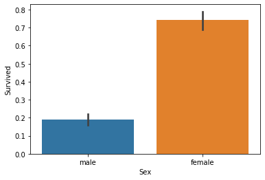


Pclass Feature：乘客社会等级越高，幸存率越高


```python
sns.barplot(x="Pclass", y="Survived", data=train)
```


    <matplotlib.axes._subplots.AxesSubplot at 0x1e9e2ab4080>


SibSp Feature：配偶及兄弟姐妹数适中的乘客幸存率更高


```python
sns.barplot(x="SibSp", y="Survived", data=train)
```


    <matplotlib.axes._subplots.AxesSubplot at 0x1e9e2b252b0>


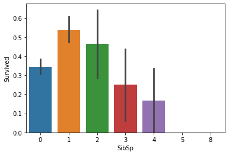


Parch Feature：父母与子女数适中的乘客幸存率更高


```python
sns.barplot(x="Parch", y="Survived", data=train)
```


    <matplotlib.axes._subplots.AxesSubplot at 0x1e9e2bb0b70>


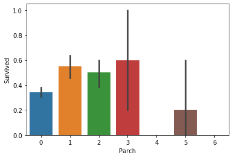


Embarked登港港口与生存情况的分析

结果分析:C地的生存率更高,这个也应该保留为模型特征.


```python
sns.countplot('Embarked',hue='Survived',data=train)
```


    <matplotlib.axes._subplots.AxesSubplot at 0x1e9e2c230b8>


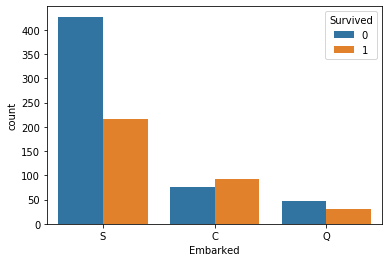


从不同生还情况的密度图可以看出，在年龄15岁的左侧，生还率有明显差别，密度图非交叉区域面积非常大，但在其他年龄段，则差别不是很明显，认为是随机所致，因此可以考虑将此年龄偏小的区域分离出来。


```python
facet = sns.FacetGrid(train, hue="Survived", aspect=2)
facet.map(sns.kdeplot, 'Age', shade=True)
facet.set(xlim=(0, train['Age'].max()))
facet.add_legend()
plt.xlabel('Age')
plt.ylabel('density')
```


    Text(12.359751157407416, 0.5, 'density')


从生还情况密度图，在票价大于三十时生还的概率比死亡的要高，因此可以把票价较高的个体分离出来当作特征。


```python
facet = sns.FacetGrid(train, hue="Survived", aspect=2)
facet.map(sns.kdeplot, 'Fare', shade=True)
facet.set(xlim=(0, train['Fare'].max()/4))
facet.add_legend()
plt.xlabel('Fare')
plt.ylabel('density')
```


    Text(12.359751157407416, 0.5, 'density')


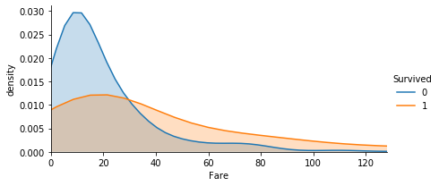


还可以看出对于票价超高的人来说，生还的概率很大


```python
facet = sns.FacetGrid(train, hue="Survived", aspect=2)
facet.map(sns.kdeplot, 'Fare', shade=True)
facet.set(xlim=(train['Fare'].max()/4, train['Fare'].max()), ylim=(0, 0.0025))
facet.add_legend()
plt.xlabel('Fare')
plt.ylabel('density')
```


    Text(6.109751157407416, 0.5, 'density')


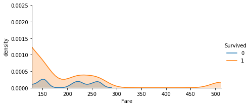


## 特征工程

### 新增特征


```python
all_data = pd.concat([train, test], ignore_index=True)
```


```python
all_data.head()
```


<div>
<style scoped>
    .dataframe tbody tr th:only-of-type {
        vertical-align: middle;
    }

    .dataframe tbody tr th {
        vertical-align: top;
    }
    
    .dataframe thead th {
        text-align: right;
    }
</style>
<table border="1" class="dataframe">
  <thead>
    <tr style="text-align: right;">
      <th></th>
      <th>Age</th>
      <th>Cabin</th>
      <th>Embarked</th>
      <th>Fare</th>
      <th>Name</th>
      <th>Parch</th>
      <th>PassengerId</th>
      <th>Pclass</th>
      <th>Sex</th>
      <th>SibSp</th>
      <th>Survived</th>
      <th>Ticket</th>
    </tr>
  </thead>
  <tbody>
    <tr>
      <th>0</th>
      <td>22.0</td>
      <td>NaN</td>
      <td>S</td>
      <td>7.2500</td>
      <td>Braund, Mr. Owen Harris</td>
      <td>0</td>
      <td>1</td>
      <td>3</td>
      <td>male</td>
      <td>1</td>
      <td>0.0</td>
      <td>A/5 21171</td>
    </tr>
    <tr>
      <th>1</th>
      <td>38.0</td>
      <td>C85</td>
      <td>C</td>
      <td>71.2833</td>
      <td>Cumings, Mrs. John Bradley (Florence Briggs Th...</td>
      <td>0</td>
      <td>2</td>
      <td>1</td>
      <td>female</td>
      <td>1</td>
      <td>1.0</td>
      <td>PC 17599</td>
    </tr>
    <tr>
      <th>2</th>
      <td>26.0</td>
      <td>NaN</td>
      <td>S</td>
      <td>7.9250</td>
      <td>Heikkinen, Miss. Laina</td>
      <td>0</td>
      <td>3</td>
      <td>3</td>
      <td>female</td>
      <td>0</td>
      <td>1.0</td>
      <td>STON/O2. 3101282</td>
    </tr>
    <tr>
      <th>3</th>
      <td>35.0</td>
      <td>C123</td>
      <td>S</td>
      <td>53.1000</td>
      <td>Futrelle, Mrs. Jacques Heath (Lily May Peel)</td>
      <td>0</td>
      <td>4</td>
      <td>1</td>
      <td>female</td>
      <td>1</td>
      <td>1.0</td>
      <td>113803</td>
    </tr>
    <tr>
      <th>4</th>
      <td>35.0</td>
      <td>NaN</td>
      <td>S</td>
      <td>8.0500</td>
      <td>Allen, Mr. William Henry</td>
      <td>0</td>
      <td>5</td>
      <td>3</td>
      <td>male</td>
      <td>0</td>
      <td>0.0</td>
      <td>373450</td>
    </tr>
  </tbody>
</table>
</div>


Title Feature(New)：不同称呼的乘客幸存率不同

新增Title特征，从姓名中提取乘客的称呼，归纳为六类。


```python
all_data['Title'] = all_data['Name'].apply(lambda x:x.split(',')[1].split('.')[0].strip())
```


```python
set(all_data['Title'])
```


    {'Capt',
     'Col',
     'Don',
     'Dona',
     'Dr',
     'Jonkheer',
     'Lady',
     'Major',
     'Master',
     'Miss',
     'Mlle',
     'Mme',
     'Mr',
     'Mrs',
     'Ms',
     'Rev',
     'Sir',
     'the Countess'}


```python
all_data.head()
```


<div>
<style scoped>
    .dataframe tbody tr th:only-of-type {
        vertical-align: middle;
    }

    .dataframe tbody tr th {
        vertical-align: top;
    }
    
    .dataframe thead th {
        text-align: right;
    }
</style>
<table border="1" class="dataframe">
  <thead>
    <tr style="text-align: right;">
      <th></th>
      <th>Age</th>
      <th>Cabin</th>
      <th>Embarked</th>
      <th>Fare</th>
      <th>Name</th>
      <th>Parch</th>
      <th>PassengerId</th>
      <th>Pclass</th>
      <th>Sex</th>
      <th>SibSp</th>
      <th>Survived</th>
      <th>Ticket</th>
      <th>Title</th>
    </tr>
  </thead>
  <tbody>
    <tr>
      <th>0</th>
      <td>22.0</td>
      <td>NaN</td>
      <td>S</td>
      <td>7.2500</td>
      <td>Braund, Mr. Owen Harris</td>
      <td>0</td>
      <td>1</td>
      <td>3</td>
      <td>male</td>
      <td>1</td>
      <td>0.0</td>
      <td>A/5 21171</td>
      <td>Mr</td>
    </tr>
    <tr>
      <th>1</th>
      <td>38.0</td>
      <td>C85</td>
      <td>C</td>
      <td>71.2833</td>
      <td>Cumings, Mrs. John Bradley (Florence Briggs Th...</td>
      <td>0</td>
      <td>2</td>
      <td>1</td>
      <td>female</td>
      <td>1</td>
      <td>1.0</td>
      <td>PC 17599</td>
      <td>Mrs</td>
    </tr>
    <tr>
      <th>2</th>
      <td>26.0</td>
      <td>NaN</td>
      <td>S</td>
      <td>7.9250</td>
      <td>Heikkinen, Miss. Laina</td>
      <td>0</td>
      <td>3</td>
      <td>3</td>
      <td>female</td>
      <td>0</td>
      <td>1.0</td>
      <td>STON/O2. 3101282</td>
      <td>Miss</td>
    </tr>
    <tr>
      <th>3</th>
      <td>35.0</td>
      <td>C123</td>
      <td>S</td>
      <td>53.1000</td>
      <td>Futrelle, Mrs. Jacques Heath (Lily May Peel)</td>
      <td>0</td>
      <td>4</td>
      <td>1</td>
      <td>female</td>
      <td>1</td>
      <td>1.0</td>
      <td>113803</td>
      <td>Mrs</td>
    </tr>
    <tr>
      <th>4</th>
      <td>35.0</td>
      <td>NaN</td>
      <td>S</td>
      <td>8.0500</td>
      <td>Allen, Mr. William Henry</td>
      <td>0</td>
      <td>5</td>
      <td>3</td>
      <td>male</td>
      <td>0</td>
      <td>0.0</td>
      <td>373450</td>
      <td>Mr</td>
    </tr>
  </tbody>
</table>
</div>


```python
# 将称呼分类
Title_Dict = {}
Title_Dict.update(dict.fromkeys(['Capt', 'Col', 'Major', 'Dr', 'Rev'], 'Officer'))
Title_Dict.update(dict.fromkeys(['Don', 'Sir', 'the Countess', 'Dona', 'Lady'], 'Royalty'))
Title_Dict.update(dict.fromkeys(['Mme', 'Ms', 'Mrs'], 'Mrs'))
Title_Dict.update(dict.fromkeys(['Mlle', 'Miss'], 'Miss'))
Title_Dict.update(dict.fromkeys(['Mr'], 'Mr'))
Title_Dict.update(dict.fromkeys(['Master','Jonkheer'], 'Master'))

all_data['Title'] = all_data['Title'].map(Title_Dict)
sns.barplot(x="Title", y="Survived", data=all_data)
```


    <matplotlib.axes._subplots.AxesSubplot at 0x1e9e2e7e2b0>


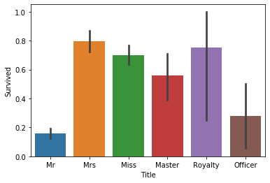


```python
all_data.head(20)
```


<div>
<style scoped>
    .dataframe tbody tr th:only-of-type {
        vertical-align: middle;
    }

    .dataframe tbody tr th {
        vertical-align: top;
    }
    
    .dataframe thead th {
        text-align: right;
    }
</style>
<table border="1" class="dataframe">
  <thead>
    <tr style="text-align: right;">
      <th></th>
      <th>Age</th>
      <th>Cabin</th>
      <th>Embarked</th>
      <th>Fare</th>
      <th>Name</th>
      <th>Parch</th>
      <th>PassengerId</th>
      <th>Pclass</th>
      <th>Sex</th>
      <th>SibSp</th>
      <th>Survived</th>
      <th>Ticket</th>
      <th>Title</th>
    </tr>
  </thead>
  <tbody>
    <tr>
      <th>0</th>
      <td>22.0</td>
      <td>NaN</td>
      <td>S</td>
      <td>7.2500</td>
      <td>Braund, Mr. Owen Harris</td>
      <td>0</td>
      <td>1</td>
      <td>3</td>
      <td>male</td>
      <td>1</td>
      <td>0.0</td>
      <td>A/5 21171</td>
      <td>Mr</td>
    </tr>
    <tr>
      <th>1</th>
      <td>38.0</td>
      <td>C85</td>
      <td>C</td>
      <td>71.2833</td>
      <td>Cumings, Mrs. John Bradley (Florence Briggs Th...</td>
      <td>0</td>
      <td>2</td>
      <td>1</td>
      <td>female</td>
      <td>1</td>
      <td>1.0</td>
      <td>PC 17599</td>
      <td>Mrs</td>
    </tr>
    <tr>
      <th>2</th>
      <td>26.0</td>
      <td>NaN</td>
      <td>S</td>
      <td>7.9250</td>
      <td>Heikkinen, Miss. Laina</td>
      <td>0</td>
      <td>3</td>
      <td>3</td>
      <td>female</td>
      <td>0</td>
      <td>1.0</td>
      <td>STON/O2. 3101282</td>
      <td>Miss</td>
    </tr>
    <tr>
      <th>3</th>
      <td>35.0</td>
      <td>C123</td>
      <td>S</td>
      <td>53.1000</td>
      <td>Futrelle, Mrs. Jacques Heath (Lily May Peel)</td>
      <td>0</td>
      <td>4</td>
      <td>1</td>
      <td>female</td>
      <td>1</td>
      <td>1.0</td>
      <td>113803</td>
      <td>Mrs</td>
    </tr>
    <tr>
      <th>4</th>
      <td>35.0</td>
      <td>NaN</td>
      <td>S</td>
      <td>8.0500</td>
      <td>Allen, Mr. William Henry</td>
      <td>0</td>
      <td>5</td>
      <td>3</td>
      <td>male</td>
      <td>0</td>
      <td>0.0</td>
      <td>373450</td>
      <td>Mr</td>
    </tr>
    <tr>
      <th>5</th>
      <td>NaN</td>
      <td>NaN</td>
      <td>Q</td>
      <td>8.4583</td>
      <td>Moran, Mr. James</td>
      <td>0</td>
      <td>6</td>
      <td>3</td>
      <td>male</td>
      <td>0</td>
      <td>0.0</td>
      <td>330877</td>
      <td>Mr</td>
    </tr>
    <tr>
      <th>6</th>
      <td>54.0</td>
      <td>E46</td>
      <td>S</td>
      <td>51.8625</td>
      <td>McCarthy, Mr. Timothy J</td>
      <td>0</td>
      <td>7</td>
      <td>1</td>
      <td>male</td>
      <td>0</td>
      <td>0.0</td>
      <td>17463</td>
      <td>Mr</td>
    </tr>
    <tr>
      <th>7</th>
      <td>2.0</td>
      <td>NaN</td>
      <td>S</td>
      <td>21.0750</td>
      <td>Palsson, Master. Gosta Leonard</td>
      <td>1</td>
      <td>8</td>
      <td>3</td>
      <td>male</td>
      <td>3</td>
      <td>0.0</td>
      <td>349909</td>
      <td>Master</td>
    </tr>
    <tr>
      <th>8</th>
      <td>27.0</td>
      <td>NaN</td>
      <td>S</td>
      <td>11.1333</td>
      <td>Johnson, Mrs. Oscar W (Elisabeth Vilhelmina Berg)</td>
      <td>2</td>
      <td>9</td>
      <td>3</td>
      <td>female</td>
      <td>0</td>
      <td>1.0</td>
      <td>347742</td>
      <td>Mrs</td>
    </tr>
    <tr>
      <th>9</th>
      <td>14.0</td>
      <td>NaN</td>
      <td>C</td>
      <td>30.0708</td>
      <td>Nasser, Mrs. Nicholas (Adele Achem)</td>
      <td>0</td>
      <td>10</td>
      <td>2</td>
      <td>female</td>
      <td>1</td>
      <td>1.0</td>
      <td>237736</td>
      <td>Mrs</td>
    </tr>
    <tr>
      <th>10</th>
      <td>4.0</td>
      <td>G6</td>
      <td>S</td>
      <td>16.7000</td>
      <td>Sandstrom, Miss. Marguerite Rut</td>
      <td>1</td>
      <td>11</td>
      <td>3</td>
      <td>female</td>
      <td>1</td>
      <td>1.0</td>
      <td>PP 9549</td>
      <td>Miss</td>
    </tr>
    <tr>
      <th>11</th>
      <td>58.0</td>
      <td>C103</td>
      <td>S</td>
      <td>26.5500</td>
      <td>Bonnell, Miss. Elizabeth</td>
      <td>0</td>
      <td>12</td>
      <td>1</td>
      <td>female</td>
      <td>0</td>
      <td>1.0</td>
      <td>113783</td>
      <td>Miss</td>
    </tr>
    <tr>
      <th>12</th>
      <td>20.0</td>
      <td>NaN</td>
      <td>S</td>
      <td>8.0500</td>
      <td>Saundercock, Mr. William Henry</td>
      <td>0</td>
      <td>13</td>
      <td>3</td>
      <td>male</td>
      <td>0</td>
      <td>0.0</td>
      <td>A/5. 2151</td>
      <td>Mr</td>
    </tr>
    <tr>
      <th>13</th>
      <td>39.0</td>
      <td>NaN</td>
      <td>S</td>
      <td>31.2750</td>
      <td>Andersson, Mr. Anders Johan</td>
      <td>5</td>
      <td>14</td>
      <td>3</td>
      <td>male</td>
      <td>1</td>
      <td>0.0</td>
      <td>347082</td>
      <td>Mr</td>
    </tr>
    <tr>
      <th>14</th>
      <td>14.0</td>
      <td>NaN</td>
      <td>S</td>
      <td>7.8542</td>
      <td>Vestrom, Miss. Hulda Amanda Adolfina</td>
      <td>0</td>
      <td>15</td>
      <td>3</td>
      <td>female</td>
      <td>0</td>
      <td>0.0</td>
      <td>350406</td>
      <td>Miss</td>
    </tr>
    <tr>
      <th>15</th>
      <td>55.0</td>
      <td>NaN</td>
      <td>S</td>
      <td>16.0000</td>
      <td>Hewlett, Mrs. (Mary D Kingcome)</td>
      <td>0</td>
      <td>16</td>
      <td>2</td>
      <td>female</td>
      <td>0</td>
      <td>1.0</td>
      <td>248706</td>
      <td>Mrs</td>
    </tr>
    <tr>
      <th>16</th>
      <td>2.0</td>
      <td>NaN</td>
      <td>Q</td>
      <td>29.1250</td>
      <td>Rice, Master. Eugene</td>
      <td>1</td>
      <td>17</td>
      <td>3</td>
      <td>male</td>
      <td>4</td>
      <td>0.0</td>
      <td>382652</td>
      <td>Master</td>
    </tr>
    <tr>
      <th>17</th>
      <td>NaN</td>
      <td>NaN</td>
      <td>S</td>
      <td>13.0000</td>
      <td>Williams, Mr. Charles Eugene</td>
      <td>0</td>
      <td>18</td>
      <td>2</td>
      <td>male</td>
      <td>0</td>
      <td>1.0</td>
      <td>244373</td>
      <td>Mr</td>
    </tr>
    <tr>
      <th>18</th>
      <td>31.0</td>
      <td>NaN</td>
      <td>S</td>
      <td>18.0000</td>
      <td>Vander Planke, Mrs. Julius (Emelia Maria Vande...</td>
      <td>0</td>
      <td>19</td>
      <td>3</td>
      <td>female</td>
      <td>1</td>
      <td>0.0</td>
      <td>345763</td>
      <td>Mrs</td>
    </tr>
    <tr>
      <th>19</th>
      <td>NaN</td>
      <td>NaN</td>
      <td>C</td>
      <td>7.2250</td>
      <td>Masselmani, Mrs. Fatima</td>
      <td>0</td>
      <td>20</td>
      <td>3</td>
      <td>female</td>
      <td>0</td>
      <td>1.0</td>
      <td>2649</td>
      <td>Mrs</td>
    </tr>
  </tbody>
</table>
</div>


FamilyLabel Feature(New)：家庭人数为2到4的乘客幸存率较高

新增FamilyLabel特征，先计算FamilySize=Parch+SibSp+1，然后把FamilySize分为三类。


```python
all_data['FamilySize']=all_data['SibSp']+all_data['Parch']+1
sns.barplot(x="FamilySize", y="Survived", data=all_data)
```


    <matplotlib.axes._subplots.AxesSubplot at 0x1e9e2e80978>


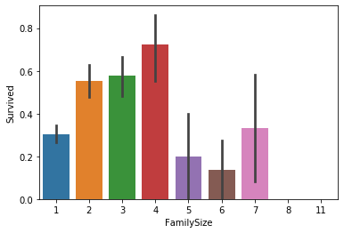


按生存率把FamilySize分为三类，构成FamilyLabel特征。


```python
def Fam_label(s):
    if s in [2, 3, 4]:
        return 2
    elif s in [1, 5, 6, 7]:
        return 1
    else:
        return 0
all_data['FamilyLabel'] = all_data['FamilySize'].apply(Fam_label)
sns.barplot(x="FamilyLabel", y="Survived", data=all_data)
```


    <matplotlib.axes._subplots.AxesSubplot at 0x1e9e2f60240>


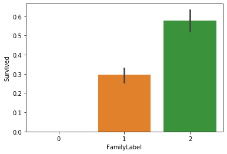


Deck Feature(New)：不同甲板的乘客幸存率不同

新增Deck特征，先把Cabin空缺值填充为'Unknown'，再提取Cabin中的首字母构成乘客的甲板号。


```python
all_data['Cabin'] = all_data['Cabin'].fillna('Unknown')
all_data['Deck']=all_data['Cabin'].str.get(0)
sns.barplot(x="Deck", y="Survived", data=all_data)
```


    <matplotlib.axes._subplots.AxesSubplot at 0x1e9e2fb9208>


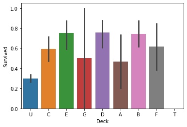


TicketGroup Feature(New)：与2至4人共票号的乘客幸存率较高

新增TicketGroup特征，统计每个乘客的共票号数。


```python
Ticket_Count = dict(all_data['Ticket'].value_counts())
```


```python
# Ticket_Count
```


```python
all_data['TicketGroup'] = all_data['Ticket'].apply(lambda x:Ticket_Count[x])
sns.barplot(x='TicketGroup', y='Survived', data=all_data)
```


    <matplotlib.axes._subplots.AxesSubplot at 0x1e9e303de80>


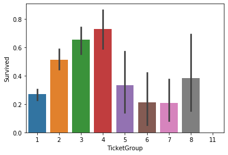


```python
def Ticket_Label(s):
    if s in [2, 3, 4]:
        return 2
    elif s in [1, 5, 6, 7, 8]:
        return 1
    else:
        return 0

all_data['TicketGroup'] = all_data['TicketGroup'].apply(Ticket_Label)
sns.barplot(x='TicketGroup', y='Survived', data=all_data)
```


    <matplotlib.axes._subplots.AxesSubplot at 0x1e9e30c8da0>


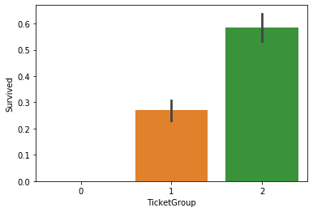


### 缺失值填充

Embarked Feature：Embarked缺失量为2，缺失Embarked信息的乘客的Pclass均为1，且Fare均为80，因为Embarked为C且Pclass为1的乘客的Fare中位数为80，所以缺失值填充为C。


```python
all_data[all_data['Embarked'].isnull()]
```


<div>
<style scoped>
    .dataframe tbody tr th:only-of-type {
        vertical-align: middle;
    }

    .dataframe tbody tr th {
        vertical-align: top;
    }
    
    .dataframe thead th {
        text-align: right;
    }
</style>
<table border="1" class="dataframe">
  <thead>
    <tr style="text-align: right;">
      <th></th>
      <th>Age</th>
      <th>Cabin</th>
      <th>Embarked</th>
      <th>Fare</th>
      <th>Name</th>
      <th>Parch</th>
      <th>PassengerId</th>
      <th>Pclass</th>
      <th>Sex</th>
      <th>SibSp</th>
      <th>Survived</th>
      <th>Ticket</th>
      <th>Title</th>
      <th>FamilySize</th>
      <th>FamilyLabel</th>
      <th>Deck</th>
      <th>TicketGroup</th>
    </tr>
  </thead>
  <tbody>
    <tr>
      <th>61</th>
      <td>38.0</td>
      <td>B28</td>
      <td>NaN</td>
      <td>80.0</td>
      <td>Icard, Miss. Amelie</td>
      <td>0</td>
      <td>62</td>
      <td>1</td>
      <td>female</td>
      <td>0</td>
      <td>1.0</td>
      <td>113572</td>
      <td>Miss</td>
      <td>1</td>
      <td>1</td>
      <td>B</td>
      <td>2</td>
    </tr>
    <tr>
      <th>829</th>
      <td>62.0</td>
      <td>B28</td>
      <td>NaN</td>
      <td>80.0</td>
      <td>Stone, Mrs. George Nelson (Martha Evelyn)</td>
      <td>0</td>
      <td>830</td>
      <td>1</td>
      <td>female</td>
      <td>0</td>
      <td>1.0</td>
      <td>113572</td>
      <td>Mrs</td>
      <td>1</td>
      <td>1</td>
      <td>B</td>
      <td>2</td>
    </tr>
  </tbody>
</table>
</div>


```python
all_data.groupby(by=["Embarked", "Pclass"]).Fare.median()
```


    Embarked  Pclass
    C         1         76.7292
              2         15.3146
              3          7.8958
    Q         1         90.0000
              2         12.3500
              3          7.7500
    S         1         52.0000
              2         15.3750
              3          8.0500
    Name: Fare, dtype: float64


```python
all_data['Embarked'] = all_data['Embarked'].fillna('C')
```

Fare Feature：Fare缺失量为1，缺失Fare信息的乘客的Embarked为S，Pclass为3，所以用Embarked为S，Pclass为3的乘客的Fare中位数填充。


```python
all_data[all_data['Fare'].isnull()]
```


<div>
<style scoped>
    .dataframe tbody tr th:only-of-type {
        vertical-align: middle;
    }

    .dataframe tbody tr th {
        vertical-align: top;
    }
    
    .dataframe thead th {
        text-align: right;
    }
</style>
<table border="1" class="dataframe">
  <thead>
    <tr style="text-align: right;">
      <th></th>
      <th>Age</th>
      <th>Cabin</th>
      <th>Embarked</th>
      <th>Fare</th>
      <th>Name</th>
      <th>Parch</th>
      <th>PassengerId</th>
      <th>Pclass</th>
      <th>Sex</th>
      <th>SibSp</th>
      <th>Survived</th>
      <th>Ticket</th>
      <th>Title</th>
      <th>FamilySize</th>
      <th>FamilyLabel</th>
      <th>Deck</th>
      <th>TicketGroup</th>
    </tr>
  </thead>
  <tbody>
    <tr>
      <th>1043</th>
      <td>60.5</td>
      <td>Unknown</td>
      <td>S</td>
      <td>NaN</td>
      <td>Storey, Mr. Thomas</td>
      <td>0</td>
      <td>1044</td>
      <td>3</td>
      <td>male</td>
      <td>0</td>
      <td>NaN</td>
      <td>3701</td>
      <td>Mr</td>
      <td>1</td>
      <td>1</td>
      <td>U</td>
      <td>1</td>
    </tr>
  </tbody>
</table>
</div>


```python
fare=all_data[(all_data['Embarked'] == "S") & (all_data['Pclass'] == 3)].Fare.median()
all_data['Fare']=all_data['Fare'].fillna(fare)
```

Age Feature：Age缺失量为263，缺失量较大，用Sex, Title, Pclass, Embarked, Fare五个特征构建随机森林模型，填充年龄缺失值。


```python
from sklearn.ensemble import RandomForestRegressor
age_df = all_data[['Age', 'Pclass','Sex','Title', 'Embarked', 'Fare']]
# age_df = all_data[['Age', 'Pclass','Sex','Title']]
```


```python
age_df.head()
```


<div>
<style scoped>
    .dataframe tbody tr th:only-of-type {
        vertical-align: middle;
    }

    .dataframe tbody tr th {
        vertical-align: top;
    }
    
    .dataframe thead th {
        text-align: right;
    }
</style>
<table border="1" class="dataframe">
  <thead>
    <tr style="text-align: right;">
      <th></th>
      <th>Age</th>
      <th>Pclass</th>
      <th>Sex</th>
      <th>Title</th>
      <th>Embarked</th>
      <th>Fare</th>
    </tr>
  </thead>
  <tbody>
    <tr>
      <th>0</th>
      <td>22.0</td>
      <td>3</td>
      <td>male</td>
      <td>Mr</td>
      <td>S</td>
      <td>7.2500</td>
    </tr>
    <tr>
      <th>1</th>
      <td>38.0</td>
      <td>1</td>
      <td>female</td>
      <td>Mrs</td>
      <td>C</td>
      <td>71.2833</td>
    </tr>
    <tr>
      <th>2</th>
      <td>26.0</td>
      <td>3</td>
      <td>female</td>
      <td>Miss</td>
      <td>S</td>
      <td>7.9250</td>
    </tr>
    <tr>
      <th>3</th>
      <td>35.0</td>
      <td>1</td>
      <td>female</td>
      <td>Mrs</td>
      <td>S</td>
      <td>53.1000</td>
    </tr>
    <tr>
      <th>4</th>
      <td>35.0</td>
      <td>3</td>
      <td>male</td>
      <td>Mr</td>
      <td>S</td>
      <td>8.0500</td>
    </tr>
  </tbody>
</table>
</div>


```python
# one_hot编码, 独热编码
age_df = pd.get_dummies(age_df)
```


```python
age_df.head()
```


<div>
<style scoped>
    .dataframe tbody tr th:only-of-type {
        vertical-align: middle;
    }

    .dataframe tbody tr th {
        vertical-align: top;
    }
    
    .dataframe thead th {
        text-align: right;
    }
</style>
<table border="1" class="dataframe">
  <thead>
    <tr style="text-align: right;">
      <th></th>
      <th>Age</th>
      <th>Pclass</th>
      <th>Fare</th>
      <th>Sex_female</th>
      <th>Sex_male</th>
      <th>Title_Master</th>
      <th>Title_Miss</th>
      <th>Title_Mr</th>
      <th>Title_Mrs</th>
      <th>Title_Officer</th>
      <th>Title_Royalty</th>
      <th>Embarked_C</th>
      <th>Embarked_Q</th>
      <th>Embarked_S</th>
    </tr>
  </thead>
  <tbody>
    <tr>
      <th>0</th>
      <td>22.0</td>
      <td>3</td>
      <td>7.2500</td>
      <td>0</td>
      <td>1</td>
      <td>0</td>
      <td>0</td>
      <td>1</td>
      <td>0</td>
      <td>0</td>
      <td>0</td>
      <td>0</td>
      <td>0</td>
      <td>1</td>
    </tr>
    <tr>
      <th>1</th>
      <td>38.0</td>
      <td>1</td>
      <td>71.2833</td>
      <td>1</td>
      <td>0</td>
      <td>0</td>
      <td>0</td>
      <td>0</td>
      <td>1</td>
      <td>0</td>
      <td>0</td>
      <td>1</td>
      <td>0</td>
      <td>0</td>
    </tr>
    <tr>
      <th>2</th>
      <td>26.0</td>
      <td>3</td>
      <td>7.9250</td>
      <td>1</td>
      <td>0</td>
      <td>0</td>
      <td>1</td>
      <td>0</td>
      <td>0</td>
      <td>0</td>
      <td>0</td>
      <td>0</td>
      <td>0</td>
      <td>1</td>
    </tr>
    <tr>
      <th>3</th>
      <td>35.0</td>
      <td>1</td>
      <td>53.1000</td>
      <td>1</td>
      <td>0</td>
      <td>0</td>
      <td>0</td>
      <td>0</td>
      <td>1</td>
      <td>0</td>
      <td>0</td>
      <td>0</td>
      <td>0</td>
      <td>1</td>
    </tr>
    <tr>
      <th>4</th>
      <td>35.0</td>
      <td>3</td>
      <td>8.0500</td>
      <td>0</td>
      <td>1</td>
      <td>0</td>
      <td>0</td>
      <td>1</td>
      <td>0</td>
      <td>0</td>
      <td>0</td>
      <td>0</td>
      <td>0</td>
      <td>1</td>
    </tr>
  </tbody>
</table>
</div>


```python
known_age = age_df[age_df.Age.notnull()].as_matrix()
unknown_age = age_df[age_df.Age.isnull()].as_matrix()
y = known_age[:, 0]
X = known_age[:, 1:]
```


```python
rfr = RandomForestRegressor(random_state=0, n_estimators=100, n_jobs=-1)
rfr.fit(X, y)
predictedAges = rfr.predict(unknown_age[:, 1:])
all_data.loc[ (all_data.Age.isnull()), 'Age' ] = predictedAges 
```

### 同组识别

把姓氏相同的乘客划分为同一组，从人数大于一的组中分别提取出每组的妇女儿童和成年男性。


```python
all_data['Surname']=all_data['Name'].apply(lambda x:x.split(',')[0].strip())
Surname_Count = dict(all_data['Surname'].value_counts())
```


```python
all_data['FamilyGroup'] = all_data['Surname'].apply(lambda x:Surname_Count[x])
```


```python
all_data.head()
```


<div>
<style scoped>
    .dataframe tbody tr th:only-of-type {
        vertical-align: middle;
    }

    .dataframe tbody tr th {
        vertical-align: top;
    }
    
    .dataframe thead th {
        text-align: right;
    }
</style>
<table border="1" class="dataframe">
  <thead>
    <tr style="text-align: right;">
      <th></th>
      <th>Age</th>
      <th>Cabin</th>
      <th>Embarked</th>
      <th>Fare</th>
      <th>Name</th>
      <th>Parch</th>
      <th>PassengerId</th>
      <th>Pclass</th>
      <th>Sex</th>
      <th>SibSp</th>
      <th>Survived</th>
      <th>Ticket</th>
      <th>Title</th>
      <th>FamilySize</th>
      <th>FamilyLabel</th>
      <th>Deck</th>
      <th>TicketGroup</th>
      <th>Surname</th>
      <th>FamilyGroup</th>
    </tr>
  </thead>
  <tbody>
    <tr>
      <th>0</th>
      <td>22.0</td>
      <td>Unknown</td>
      <td>S</td>
      <td>7.2500</td>
      <td>Braund, Mr. Owen Harris</td>
      <td>0</td>
      <td>1</td>
      <td>3</td>
      <td>male</td>
      <td>1</td>
      <td>0.0</td>
      <td>A/5 21171</td>
      <td>Mr</td>
      <td>2</td>
      <td>2</td>
      <td>U</td>
      <td>1</td>
      <td>Braund</td>
      <td>2</td>
    </tr>
    <tr>
      <th>1</th>
      <td>38.0</td>
      <td>C85</td>
      <td>C</td>
      <td>71.2833</td>
      <td>Cumings, Mrs. John Bradley (Florence Briggs Th...</td>
      <td>0</td>
      <td>2</td>
      <td>1</td>
      <td>female</td>
      <td>1</td>
      <td>1.0</td>
      <td>PC 17599</td>
      <td>Mrs</td>
      <td>2</td>
      <td>2</td>
      <td>C</td>
      <td>2</td>
      <td>Cumings</td>
      <td>2</td>
    </tr>
    <tr>
      <th>2</th>
      <td>26.0</td>
      <td>Unknown</td>
      <td>S</td>
      <td>7.9250</td>
      <td>Heikkinen, Miss. Laina</td>
      <td>0</td>
      <td>3</td>
      <td>3</td>
      <td>female</td>
      <td>0</td>
      <td>1.0</td>
      <td>STON/O2. 3101282</td>
      <td>Miss</td>
      <td>1</td>
      <td>1</td>
      <td>U</td>
      <td>1</td>
      <td>Heikkinen</td>
      <td>1</td>
    </tr>
    <tr>
      <th>3</th>
      <td>35.0</td>
      <td>C123</td>
      <td>S</td>
      <td>53.1000</td>
      <td>Futrelle, Mrs. Jacques Heath (Lily May Peel)</td>
      <td>0</td>
      <td>4</td>
      <td>1</td>
      <td>female</td>
      <td>1</td>
      <td>1.0</td>
      <td>113803</td>
      <td>Mrs</td>
      <td>2</td>
      <td>2</td>
      <td>C</td>
      <td>2</td>
      <td>Futrelle</td>
      <td>2</td>
    </tr>
    <tr>
      <th>4</th>
      <td>35.0</td>
      <td>Unknown</td>
      <td>S</td>
      <td>8.0500</td>
      <td>Allen, Mr. William Henry</td>
      <td>0</td>
      <td>5</td>
      <td>3</td>
      <td>male</td>
      <td>0</td>
      <td>0.0</td>
      <td>373450</td>
      <td>Mr</td>
      <td>1</td>
      <td>1</td>
      <td>U</td>
      <td>1</td>
      <td>Allen</td>
      <td>2</td>
    </tr>
  </tbody>
</table>
</div>


```python
Female_Child_Group=all_data.loc[(all_data['FamilyGroup']>=2) & ((all_data['Age']<=12) | (all_data['Sex']=='female'))]
Male_Adult_Group=all_data.loc[(all_data['FamilyGroup']>=2) & (all_data['Age']>12) & (all_data['Sex']=='male')]
```

发现绝大部分女性和儿童组的平均存活率都为1或0，即同组的女性和儿童要么全部幸存，要么全部遇难。


```python
Female_Child=pd.DataFrame(Female_Child_Group.groupby('Surname')['Survived'].mean().value_counts())
Female_Child.columns=['GroupCount']
Female_Child
```


<div>
<style scoped>
    .dataframe tbody tr th:only-of-type {
        vertical-align: middle;
    }

    .dataframe tbody tr th {
        vertical-align: top;
    }
    
    .dataframe thead th {
        text-align: right;
    }
</style>
<table border="1" class="dataframe">
  <thead>
    <tr style="text-align: right;">
      <th></th>
      <th>GroupCount</th>
    </tr>
  </thead>
  <tbody>
    <tr>
      <th>1.000000</th>
      <td>115</td>
    </tr>
    <tr>
      <th>0.000000</th>
      <td>31</td>
    </tr>
    <tr>
      <th>0.750000</th>
      <td>2</td>
    </tr>
    <tr>
      <th>0.333333</th>
      <td>1</td>
    </tr>
    <tr>
      <th>0.142857</th>
      <td>1</td>
    </tr>
  </tbody>
</table>
</div>


```python
sns.barplot(x=Female_Child.index, y=Female_Child["GroupCount"]).set_xlabel('AverageSurvived')
```


    Text(0.5, 0, 'AverageSurvived')


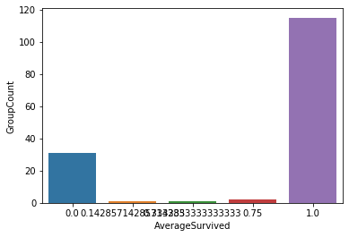


绝大部分成年男性组的平均存活率也为1或0。


```python
Male_Adult=pd.DataFrame(Male_Adult_Group.groupby('Surname')['Survived'].mean().value_counts())
Male_Adult.columns=['GroupCount']
Male_Adult
```


<div>
<style scoped>
    .dataframe tbody tr th:only-of-type {
        vertical-align: middle;
    }

    .dataframe tbody tr th {
        vertical-align: top;
    }
    
    .dataframe thead th {
        text-align: right;
    }
</style>
<table border="1" class="dataframe">
  <thead>
    <tr style="text-align: right;">
      <th></th>
      <th>GroupCount</th>
    </tr>
  </thead>
  <tbody>
    <tr>
      <th>0.000000</th>
      <td>122</td>
    </tr>
    <tr>
      <th>1.000000</th>
      <td>20</td>
    </tr>
    <tr>
      <th>0.500000</th>
      <td>6</td>
    </tr>
    <tr>
      <th>0.333333</th>
      <td>2</td>
    </tr>
    <tr>
      <th>0.250000</th>
      <td>1</td>
    </tr>
  </tbody>
</table>
</div>


### 离群点处理

因为普遍规律是女性和儿童幸存率高，成年男性幸存较低，所以我们把不符合普遍规律的反常组选出来单独处理。把女性和儿童组中幸存率为0的组设置为遇难组，把成年男性组中存活率为1的设置为幸存组，推测处于遇难组的女性和儿童幸存的可能性较低，处于幸存组的成年男性幸存的可能性较高。


```python
Female_Child_Group=Female_Child_Group.groupby('Surname')['Survived'].mean()
Dead_List=set(Female_Child_Group[Female_Child_Group.apply(lambda x:x==0)].index)
print(Dead_List)
Male_Adult_List=Male_Adult_Group.groupby('Surname')['Survived'].mean()
Survived_List=set(Male_Adult_List[Male_Adult_List.apply(lambda x:x==1)].index)
print(Survived_List)
```

    {'Zabour', 'Sage', 'Arnold-Franchi', 'Vander Planke', 'Oreskovic', 'Canavan', 'Rice', 'Lahtinen', 'Goodwin', 'Johnston', 'Lefebre', 'Robins', 'Barbara', 'Jussila', 'Olsson', 'Boulos', 'Strom', 'Van Impe', 'Rosblom', 'Bourke', 'Skoog', 'Panula', 'Palsson', 'Attalah', 'Ilmakangas', 'Ford', 'Turpin', 'Caram', 'Danbom', 'Lobb', 'Cacic'}
    {'Jussila', 'Frolicher-Stehli', 'Bishop', 'Kimball', 'McCoy', 'Harder', 'Greenfield', 'Chambers', 'Dick', 'Duff Gordon', 'Jonsson', 'Nakid', 'Beane', 'Daly', 'Bradley', 'Cardeza', 'Beckwith', 'Goldenberg', 'Taylor', 'Frauenthal'}


为了使处于这两种反常组中的样本能够被正确分类，对测试集中处于反常组中的样本的Age，Title，Sex进行惩罚修改。


```python
train=all_data.loc[all_data['Survived'].notnull()]
test=all_data.loc[all_data['Survived'].isnull()]
test.loc[(test['Surname'].apply(lambda x:x in Dead_List)),'Sex'] = 'male'
test.loc[(test['Surname'].apply(lambda x:x in Dead_List)),'Age'] = 60
test.loc[(test['Surname'].apply(lambda x:x in Dead_List)),'Title'] = 'Mr'
test.loc[(test['Surname'].apply(lambda x:x in Survived_List)),'Sex'] = 'female'
test.loc[(test['Surname'].apply(lambda x:x in Survived_List)),'Age'] = 5
test.loc[(test['Surname'].apply(lambda x:x in Survived_List)),'Title'] = 'Miss'
```

### 特征转换
选取特征，转换为数值变量，划分训练集和测试集。


```python
all_data.head()
```


<div>
<style scoped>
    .dataframe tbody tr th:only-of-type {
        vertical-align: middle;
    }

    .dataframe tbody tr th {
        vertical-align: top;
    }
    
    .dataframe thead th {
        text-align: right;
    }
</style>
<table border="1" class="dataframe">
  <thead>
    <tr style="text-align: right;">
      <th></th>
      <th>Age</th>
      <th>Cabin</th>
      <th>Embarked</th>
      <th>Fare</th>
      <th>Name</th>
      <th>Parch</th>
      <th>PassengerId</th>
      <th>Pclass</th>
      <th>Sex</th>
      <th>SibSp</th>
      <th>Survived</th>
      <th>Ticket</th>
      <th>Title</th>
      <th>FamilySize</th>
      <th>FamilyLabel</th>
      <th>Deck</th>
      <th>TicketGroup</th>
      <th>Surname</th>
      <th>FamilyGroup</th>
    </tr>
  </thead>
  <tbody>
    <tr>
      <th>0</th>
      <td>22.0</td>
      <td>Unknown</td>
      <td>S</td>
      <td>7.2500</td>
      <td>Braund, Mr. Owen Harris</td>
      <td>0</td>
      <td>1</td>
      <td>3</td>
      <td>male</td>
      <td>1</td>
      <td>0.0</td>
      <td>A/5 21171</td>
      <td>Mr</td>
      <td>2</td>
      <td>2</td>
      <td>U</td>
      <td>1</td>
      <td>Braund</td>
      <td>2</td>
    </tr>
    <tr>
      <th>1</th>
      <td>38.0</td>
      <td>C85</td>
      <td>C</td>
      <td>71.2833</td>
      <td>Cumings, Mrs. John Bradley (Florence Briggs Th...</td>
      <td>0</td>
      <td>2</td>
      <td>1</td>
      <td>female</td>
      <td>1</td>
      <td>1.0</td>
      <td>PC 17599</td>
      <td>Mrs</td>
      <td>2</td>
      <td>2</td>
      <td>C</td>
      <td>2</td>
      <td>Cumings</td>
      <td>2</td>
    </tr>
    <tr>
      <th>2</th>
      <td>26.0</td>
      <td>Unknown</td>
      <td>S</td>
      <td>7.9250</td>
      <td>Heikkinen, Miss. Laina</td>
      <td>0</td>
      <td>3</td>
      <td>3</td>
      <td>female</td>
      <td>0</td>
      <td>1.0</td>
      <td>STON/O2. 3101282</td>
      <td>Miss</td>
      <td>1</td>
      <td>1</td>
      <td>U</td>
      <td>1</td>
      <td>Heikkinen</td>
      <td>1</td>
    </tr>
    <tr>
      <th>3</th>
      <td>35.0</td>
      <td>C123</td>
      <td>S</td>
      <td>53.1000</td>
      <td>Futrelle, Mrs. Jacques Heath (Lily May Peel)</td>
      <td>0</td>
      <td>4</td>
      <td>1</td>
      <td>female</td>
      <td>1</td>
      <td>1.0</td>
      <td>113803</td>
      <td>Mrs</td>
      <td>2</td>
      <td>2</td>
      <td>C</td>
      <td>2</td>
      <td>Futrelle</td>
      <td>2</td>
    </tr>
    <tr>
      <th>4</th>
      <td>35.0</td>
      <td>Unknown</td>
      <td>S</td>
      <td>8.0500</td>
      <td>Allen, Mr. William Henry</td>
      <td>0</td>
      <td>5</td>
      <td>3</td>
      <td>male</td>
      <td>0</td>
      <td>0.0</td>
      <td>373450</td>
      <td>Mr</td>
      <td>1</td>
      <td>1</td>
      <td>U</td>
      <td>1</td>
      <td>Allen</td>
      <td>2</td>
    </tr>
  </tbody>
</table>
</div>


```python
all_data=pd.concat([train, test])
all_data=all_data[['Survived', 'Pclass', 'Sex', 'Age', 'Fare', 'Embarked', 'Title', 'FamilyLabel', 'Deck', 'TicketGroup']]
```


```python
all_data.head()
```


<div>
<style scoped>
    .dataframe tbody tr th:only-of-type {
        vertical-align: middle;
    }

    .dataframe tbody tr th {
        vertical-align: top;
    }
    
    .dataframe thead th {
        text-align: right;
    }
</style>
<table border="1" class="dataframe">
  <thead>
    <tr style="text-align: right;">
      <th></th>
      <th>Survived</th>
      <th>Pclass</th>
      <th>Sex</th>
      <th>Age</th>
      <th>Fare</th>
      <th>Embarked</th>
      <th>Title</th>
      <th>FamilyLabel</th>
      <th>Deck</th>
      <th>TicketGroup</th>
    </tr>
  </thead>
  <tbody>
    <tr>
      <th>0</th>
      <td>0.0</td>
      <td>3</td>
      <td>male</td>
      <td>22.0</td>
      <td>7.2500</td>
      <td>S</td>
      <td>Mr</td>
      <td>2</td>
      <td>U</td>
      <td>1</td>
    </tr>
    <tr>
      <th>1</th>
      <td>1.0</td>
      <td>1</td>
      <td>female</td>
      <td>38.0</td>
      <td>71.2833</td>
      <td>C</td>
      <td>Mrs</td>
      <td>2</td>
      <td>C</td>
      <td>2</td>
    </tr>
    <tr>
      <th>2</th>
      <td>1.0</td>
      <td>3</td>
      <td>female</td>
      <td>26.0</td>
      <td>7.9250</td>
      <td>S</td>
      <td>Miss</td>
      <td>1</td>
      <td>U</td>
      <td>1</td>
    </tr>
    <tr>
      <th>3</th>
      <td>1.0</td>
      <td>1</td>
      <td>female</td>
      <td>35.0</td>
      <td>53.1000</td>
      <td>S</td>
      <td>Mrs</td>
      <td>2</td>
      <td>C</td>
      <td>2</td>
    </tr>
    <tr>
      <th>4</th>
      <td>0.0</td>
      <td>3</td>
      <td>male</td>
      <td>35.0</td>
      <td>8.0500</td>
      <td>S</td>
      <td>Mr</td>
      <td>1</td>
      <td>U</td>
      <td>1</td>
    </tr>
  </tbody>
</table>
</div>


```python
all_data=pd.get_dummies(all_data)
```


```python
all_data.head()
```


<div>
<style scoped>
    .dataframe tbody tr th:only-of-type {
        vertical-align: middle;
    }

    .dataframe tbody tr th {
        vertical-align: top;
    }
    
    .dataframe thead th {
        text-align: right;
    }
</style>
<table border="1" class="dataframe">
  <thead>
    <tr style="text-align: right;">
      <th></th>
      <th>Survived</th>
      <th>Pclass</th>
      <th>Age</th>
      <th>Fare</th>
      <th>FamilyLabel</th>
      <th>TicketGroup</th>
      <th>Sex_female</th>
      <th>Sex_male</th>
      <th>Embarked_C</th>
      <th>Embarked_Q</th>
      <th>...</th>
      <th>Title_Royalty</th>
      <th>Deck_A</th>
      <th>Deck_B</th>
      <th>Deck_C</th>
      <th>Deck_D</th>
      <th>Deck_E</th>
      <th>Deck_F</th>
      <th>Deck_G</th>
      <th>Deck_T</th>
      <th>Deck_U</th>
    </tr>
  </thead>
  <tbody>
    <tr>
      <th>0</th>
      <td>0.0</td>
      <td>3</td>
      <td>22.0</td>
      <td>7.2500</td>
      <td>2</td>
      <td>1</td>
      <td>0</td>
      <td>1</td>
      <td>0</td>
      <td>0</td>
      <td>...</td>
      <td>0</td>
      <td>0</td>
      <td>0</td>
      <td>0</td>
      <td>0</td>
      <td>0</td>
      <td>0</td>
      <td>0</td>
      <td>0</td>
      <td>1</td>
    </tr>
    <tr>
      <th>1</th>
      <td>1.0</td>
      <td>1</td>
      <td>38.0</td>
      <td>71.2833</td>
      <td>2</td>
      <td>2</td>
      <td>1</td>
      <td>0</td>
      <td>1</td>
      <td>0</td>
      <td>...</td>
      <td>0</td>
      <td>0</td>
      <td>0</td>
      <td>1</td>
      <td>0</td>
      <td>0</td>
      <td>0</td>
      <td>0</td>
      <td>0</td>
      <td>0</td>
    </tr>
    <tr>
      <th>2</th>
      <td>1.0</td>
      <td>3</td>
      <td>26.0</td>
      <td>7.9250</td>
      <td>1</td>
      <td>1</td>
      <td>1</td>
      <td>0</td>
      <td>0</td>
      <td>0</td>
      <td>...</td>
      <td>0</td>
      <td>0</td>
      <td>0</td>
      <td>0</td>
      <td>0</td>
      <td>0</td>
      <td>0</td>
      <td>0</td>
      <td>0</td>
      <td>1</td>
    </tr>
    <tr>
      <th>3</th>
      <td>1.0</td>
      <td>1</td>
      <td>35.0</td>
      <td>53.1000</td>
      <td>2</td>
      <td>2</td>
      <td>1</td>
      <td>0</td>
      <td>0</td>
      <td>0</td>
      <td>...</td>
      <td>0</td>
      <td>0</td>
      <td>0</td>
      <td>1</td>
      <td>0</td>
      <td>0</td>
      <td>0</td>
      <td>0</td>
      <td>0</td>
      <td>0</td>
    </tr>
    <tr>
      <th>4</th>
      <td>0.0</td>
      <td>3</td>
      <td>35.0</td>
      <td>8.0500</td>
      <td>1</td>
      <td>1</td>
      <td>0</td>
      <td>1</td>
      <td>0</td>
      <td>0</td>
      <td>...</td>
      <td>0</td>
      <td>0</td>
      <td>0</td>
      <td>0</td>
      <td>0</td>
      <td>0</td>
      <td>0</td>
      <td>0</td>
      <td>0</td>
      <td>1</td>
    </tr>
  </tbody>
</table>
<p>5 rows × 26 columns</p>
</div>


将训练集与测试集分离


```python
train=all_data[all_data['Survived'].notnull()]
X_test=all_data[all_data['Survived'].isnull()].drop('Survived',axis=1)
X_train = train.as_matrix()[:,1:]
y_train = train.as_matrix()[:,0]
```

## 建模和优化

### 数据归一化


```python
from sklearn.preprocessing import StandardScaler
standardScaler = StandardScaler()
standardScaler.fit(X_train)
X_train = standardScaler.transform(X_train)
X_test = standardScaler.transform(X_test)
```

### PCA降维


```python
from sklearn.decomposition import PCA

pca = PCA(0.88)
pca.fit(X_train)
```


    PCA(copy=True, iterated_power='auto', n_components=0.88, random_state=None,
        svd_solver='auto', tol=0.0, whiten=False)


```python
pca.n_components_
```


    14


```python
X_train = pca.transform(X_train)
X_test = pca.transform(X_test)
```

### 参数优化

使用网格搜索寻找最优的随机森林参数n_estimators和max_depth


```python
%%time
from sklearn.pipeline import Pipeline
from sklearn.ensemble import RandomForestClassifier
from sklearn.model_selection import GridSearchCV
from sklearn.feature_selection import SelectKBest

pipe=Pipeline([
#     ('select',SelectKBest(k=20)), 
    ('classify', RandomForestClassifier(random_state = 10, max_features = 'sqrt'))
])

param_grid = [
    {
        'classify__max_depth': list(range(3,20, 1)),
        'classify__n_estimators': list(range(20, 45, 1)), 
        'classify__max_leaf_nodes': (2, 4, 8, 16, 32, 64, 128, 256),
    }
]
gsearch = GridSearchCV(estimator = pipe, param_grid = param_grid, scoring='roc_auc', n_jobs=-1, verbose=1)

gsearch.fit(X_train,y_train)
```

    Fitting 3 folds for each of 3400 candidates, totalling 10200 fits


    [Parallel(n_jobs=-1)]: Using backend LokyBackend with 4 concurrent workers.
    [Parallel(n_jobs=-1)]: Done  53 tasks      | elapsed:    4.0s
    [Parallel(n_jobs=-1)]: Done 353 tasks      | elapsed:    9.6s
    [Parallel(n_jobs=-1)]: Done 853 tasks      | elapsed:   18.7s
    [Parallel(n_jobs=-1)]: Done 1553 tasks      | elapsed:   32.7s
    [Parallel(n_jobs=-1)]: Done 2453 tasks      | elapsed:   51.1s
    [Parallel(n_jobs=-1)]: Done 3553 tasks      | elapsed:  1.3min
    [Parallel(n_jobs=-1)]: Done 4853 tasks      | elapsed:  1.8min
    [Parallel(n_jobs=-1)]: Done 6353 tasks      | elapsed:  2.4min
    [Parallel(n_jobs=-1)]: Done 8053 tasks      | elapsed:  3.1min
    [Parallel(n_jobs=-1)]: Done 9953 tasks      | elapsed:  3.9min
    [Parallel(n_jobs=-1)]: Done 10193 out of 10200 | elapsed:  4.0min remaining:    0.1s
    [Parallel(n_jobs=-1)]: Done 10200 out of 10200 | elapsed:  4.0min finished


    Wall time: 4min 1s


```python
print('Best classify max_depth is ', gsearch.best_params_['classify__max_depth'])
print('Best classify n_estimators is ', gsearch.best_params_['classify__n_estimators'])
print('Best score is ', gsearch.best_score_)
```

    Best classify max_depth is  12
    Best classify n_estimators is  44
    Best score is  0.8686527338382386


### 训练模型


```python
best_clf = gsearch.best_estimator_
best_clf.fit(X_train, y_train)
```


    Pipeline(memory=None,
             steps=[('classify',
                     RandomForestClassifier(bootstrap=True, class_weight=None,
                                            criterion='gini', max_depth=12,
                                            max_features='sqrt', max_leaf_nodes=16,
                                            min_impurity_decrease=0.0,
                                            min_impurity_split=None,
                                            min_samples_leaf=1, min_samples_split=2,
                                            min_weight_fraction_leaf=0.0,
                                            n_estimators=44, n_jobs=None,
                                            oob_score=False, random_state=10,
                                            verbose=0, warm_start=False))],
             verbose=False)


### 交叉验证


```python
from sklearn import model_selection, metrics
cv_score = model_selection.cross_val_score(best_clf, X_train, y_train)
print("CV Score : Mean - %.7g | Std - %.7g " % (np.mean(cv_score), np.std(cv_score)))
```

    CV Score : Mean - 0.8271605 | Std - 0.02861403 


### 预测


```python
y_predict = best_clf.predict(X_test)
submission = pd.DataFrame({"PassengerId": PassengerId, "Survived": y_predict.astype(np.int32)})
submission.to_csv(r".\output\submission1.csv", index=False)
```
